# teletext-cards

Your GitHub stats, broadcast like it's 1985. A GitHub Action that draws your
profile as a page of Danish Tekst-TV, and counts **all** your work, including
the organisation and team repositories that other stats cards forget.



<sub>Kim Kode is made up. Your page fills in from your own GitHub activity and redraws itself every morning.</sub>

## Why another stats card?

Most stats cards only count the repositories you own. If your best work lives
in an organisation (school projects, your job, open source), they think you
have been on holiday. teletext-cards follows your contributions instead,
wherever they happened:

- **Org and team work counts.** Commits, pull requests and reviews in other people's repositories, plus the team forks that GitHub itself leaves out.
- **Languages follow your commits.** A team repository counts by your share of its commits, not by its size.
- **Private work counts too,** without names, if you give it a [token](#tokens).
- **It runs in your own Actions.** No server, no shared rate limit, nothing to go down.

## Quick start

1. Add this workflow to your profile repository (the one named after you), as
   `.github/workflows/teletext-cards.yml`:

   ```yaml
   name: Teletext cards

   on:
     schedule:
       - cron: "17 4 * * *" # every morning
     workflow_dispatch:
     push:
       paths: [.github/workflows/teletext-cards.yml] # redraw when you change the settings

   permissions:
     contents: write # to push the cards to their own branch

   jobs:
     cards:
       runs-on: ubuntu-latest
       steps:
         - uses: Luke3520/teletext-cards@v1
           with:
             publish_branch: output
             subtitle: Developer in Copenhagen|Runs on coffee and hygge
             timezone: Europe/Copenhagen
             art: pipe-nisse
   ```

2. Run it once from the **Actions** tab. After that it redraws itself every
   morning, before anyone has had their coffee.

3. Put the page at the top of your `README.md`:

   ```html
   
   ```

Rather build your own layout? `stats.svg` and `languages.svg` land on the same
branch:




## Make it yours

| Input | What it does |
|---|---|
| `subtitle` | Up to two lines under your name, split by `\|`. |
| `art` | Pixel art next to your name: `nisse`, `pipe-nisse` (smokes a pipe, wiggles his eyebrows), `none`, or [your own](#draw-your-own). |
| `accent` | Colour of the title band: `red`, `green`, `yellow`, `blue`, `magenta`, `cyan` or `white`. |
| `timezone` | For the dates, such as `Europe/Copenhagen`. |
| `locale` | `en`, or `da` for Danish. Hej! |
| `orgs` | Pick your organisations: `name` puts one first, `name=Label` renames it, `-name` hides it. |
| `hide` | Parts to switch off, comma separated: `since`, `stars`, `visitors`, `contributions`, `last_7_days`, `streak`, `commits`, `pull_requests`, `reviews`, `repositories`, `orgs`, `languages`, `recent`, `activity`. |

<details>
<summary>All the inputs</summary>

| Input | Default | What it does |
|---|---|---|
| `github_token` | `${{ github.token }}` | API token. See [tokens](#tokens). |
| `username` | repository owner | Whose cards to draw. |
| `cards` | `page,stats,languages` | Which cards to draw. |
| `output_dir` | `teletext-cards` | Where to write the SVGs. |
| `publish_branch` | | Push the cards to this branch as a single commit, replaced on every run. Must be a branch of their own, such as `output`. Needs `contents: write`. |
| `publish_token` | `github_token` | Token for that push, if `github_token` cannot push. |
| `commit_message` | `Update teletext cards` | Message for that commit. |
| `title` | your name | The big double-height line. |
| `subtitle` | | Up to two lines under the title, split by `\|` or a newline. |
| `brand` | your login | Service name in the header. |
| `page_number` | `100` | Teletext page number, 100 to 899. |
| `accent` | `blue` | Colour of the title band. |
| `art` | `none` | Pixel art next to the title. |
| `fastext` | | Up to four labels for the coloured keys at the bottom. |
| `locale` | `en` | `en` or `da`. |
| `timezone` | `UTC` | Time zone for the dates. |
| `clock` | `date` | Right end of the header: `date`, `time` (adds a blinking clock, frozen at the time of the run, so it falls behind during the day), or `none`. |
| `languages_by` | `authorship` | `authorship` (scaled by your share of each repo's commits), `commits`, or `bytes` (the classic way). |
| `languages_count` | `5` | Languages listed before the rest become *Other*. |
| `orgs` | | Choose and rename the organisations on the ORGS line. |
| `hide` | | Parts to switch off. |
| `exclude_repos` | | `owner/name` or `owner/*`, comma separated. |
| `exclude_languages` | | Language names, comma separated. |
| `animate` | `true` | The page arrives row by row, the clock blinks (with `clock: time`), and the line under your name takes turns. |
| `crt` | `true` | Phosphor glow, scanlines and a soft vignette. |

</details>

### Draw your own

`art` takes rows of colour codes, one character per mosaic pixel (two across
and three down make one character cell): `K` black, `R` red, `G` green,
`Y` yellow, `B` blue, `M` magenta, `C` cyan, `W` white, `N` brown and `.` for
empty. Teletext never had brown, but a nisse needs a pipe.

```yaml
art: |
  ..YY..
  .YYYY.
  YKYYKY
  YYYYYY
  .YRRY.
  ..YY..
```

## Tokens

| Token | What you get |
|---|---|
| The default `github.token` | Everything public, including public organisation repositories. Nothing to set up. |
| A classic token with `repo` and `read:org` | Private repositories too, counted but never named, and your repo visitors. |

Create the classic token under **Settings → Developer settings → Personal
access tokens**, save it as a repository secret called `TELETEXT_TOKEN`, and
pass it in:

```yaml
- uses: Luke3520/teletext-cards@v1
  with:
    github_token: ${{ secrets.TELETEXT_TOKEN }}
    publish_token: ${{ github.token }}
    publish_branch: output
```

Only want the visitors? A fine-grained token with **Administration: Read-only**
on your repositories reads them too.

## Good to know

- **Private stays private.** Private repositories are counted, never named: not on the cards, not in the logs. An organisation you only know privately shows up as *+1 private*, unless you list it in `orgs`.
- **Profile views?** GitHub doesn't count them, so neither do we. It does count visitors to your repositories over the last 14 days: that's the *repo visitors* line.
- **Missing commits?** GitHub only counts a commit as yours if its author email is linked to your account. Add old emails under **Settings → Emails**.
- **Still showing yesterday's page?** GitHub caches images for a while. A hard refresh helps.
- **Your main branch is safe.** The cards live on a branch of their own, and the action refuses to publish to your default branch.

<details>
<summary>How the numbers are counted</summary>

| On the card | Where it comes from |
|---|---|
| The line under your name | Takes turns, a few seconds each, like teletext subpages: since when you've been on GitHub, your stars and your repo visitors. A still picture, or a viewer who prefers less motion, gets the first. |
| Stars | Stars on the repositories you own. Left out until you have one. |
| Repo visitors | Unique visitors of your public repositories over the last 14 days, from GitHub's own traffic numbers, added up per repository. Left out until there is one. |
| Contributions | Every day in your contribution calendars since you joined, so it matches your profile graph. Includes anonymous private contributions if your profile shows them. |
| Last 7 days | Today and the 6 days before (or the 7 days before today, while today is still empty), against an ordinary week: the average of the 12 weeks before. More than a quarter above or below is *more* or *less than usual*. |
| Streak | Days in a row with a contribution, and your longest run. An empty today doesn't break it yet. |
| Commits, code reviews | Summed from each year's contributions. When GitHub hides private work even from your own token, the action reads the history of the private repositories the token can open and counts your commits there. |
| Pull requests | All the pull requests you opened, and how many were merged. |
| Repositories | Repositories you own or contributed to, each counted once, including forks you opened pull requests in. *org/team* is how many belong to an organisation or someone else. |
| Orgs | Organisations owning a public repository you contributed to, busiest first. |
| Languages | See `languages_by`. In a fork, only commits made after forking count. |
| Recent work | The three repositories with your latest commits on their default branch: *today*, *yesterday* or the date. Your profile repository is left out, and a private one shows as *private repo*, or by its organisation's name if you list it in `orgs`. |
| 52 weeks | On the stats card: contributions per week over the last year, on a square-root scale so quiet weeks still show. The page leaves it out, because your profile already has the contribution graph. |

</details>

## Under the hood

- Real teletext lettering from [Bedstead](https://bjh21.me.uk/bedstead/), Ben Harris's public-domain recreation of the SAA5050 character chip, embedded as SVG paths. No web fonts, nothing to load.
- Eight colours, 40 columns, double height and block mosaics, like the real thing. Plus one star, which teletext never had.
- One self-contained SVG per card, around 40 kB. GitHub's image proxy blocks outside resources, so everything is inline.
- Every card carries a text description of all its numbers for screen readers, and the motion stops for anyone who asks for reduced motion.

It's TypeScript without a build step. To run it locally, use Node 22.18 or newer:

```sh
GITHUB_TOKEN=$(gh auth token) node src/cli.ts --username octocat --out cards
node src/cli.ts --fixture test/fixtures/demo.json --out examples   # no network needed
npm run check                                                      # types and tests
```

## License

MIT. Bedstead is dedicated to the public domain (CC0).

Made in Copenhagen. Tak fordi du kiggede forbi! 🇩🇰
